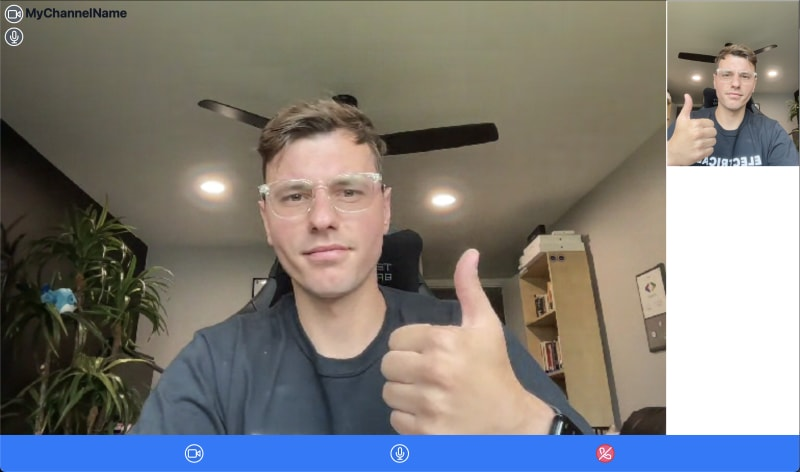

# Build a Video Call with Astro

There's this framework called Astro that is gaining a lot of popularity quickly, and I decided to learn web development so I could give it a shot. One thing led to another, I built a couple sites with it, and then I thought: "I wonder if you can build video calls with Astro". 

The answer is yes! And this article will teach you exactly how you can do it too.


## What we will use
Of course, we need Astro: since it is the title of this article. 

The second part of the title is about video calls. For that we will use Agora. Specifically, we will use the `agora-react-uikit` package. This package is a React wrapper for the [Agora UI Kit](https://docs.agora.io/en/video-calling/get-started/get-started-uikit?platform=web), which is a set of UI components that make it easy to build a video call app. 

Currently there is no native Astro package, but given that we can use almost any popular web framework within an Astro application, the `agora-react-uikit` will work just fine.

We will also use Tailwind to do some minor styling of the application.

## Create an Agora Account
[Sign up](https://sso2.agora.io/en/v6/signup) for an Agora account and log in to the dashboard.

Navigate to the Project List tab under the Project Management tab, and create a project by clicking the blue create button.

Retrieve the App ID, which we’ll use to authorize the app requests as we develop the application.

## Initialize the Astro Project
1. Create your Astro project using `npm create astro@latest`. 
2. Add Tailwind using `npx astro add tailwind`.
3. Add React using `npx astro add react`.
4. Add Agora UI Kit using `npm install agora-react-uikit`.
5. Add `PUBLIC_AGORA_APP_ID = '<---Your App Id--->'` to your `.env` file.

## Structure of the Project 
```
├── src
│   ├── components
│   │    └── Call.tsx
│   ├── layouts
│   │   └── Layout.astro
│   └── pages
│       ├── index.astro
│       └── channel
│           └── [channelName].astro
├── public
│   └── favicon.png
├── package.json
├── astro.config.js
├── tsconfig.json
└── tailwing.config.cjs
```

## Building a Form with Astro

### Astro SSG vs SSR
By default Astro projects use a static site generator (SSG) which creates a static site, that you cannot change. Astro provides a way to interface with different frameworks (React, Svelte, Vue, etc) using a mechanism called islands. Forms need to be interactive, and we could definitely use an island to get this done, however it is possible to create a form with Astro which would ship with 0 javascript.

To do that we need to enable the server-side renderer (SSR) by adding `output: 'server'` to the `astro.config.mjs` file. This means that our pages will get rendered on the server. This brings benefits of being able to access server side data and run some functions before the page loads. 

### Form UI
For the case of creating and submitting a form, we will load the page initially to show the form. Then whenever we submit the form, it will act very similar to an API endpoint. 

Normally when you submit a form the data will be added to the URL, and you would have to parse it out. By changing the forms data transfer method to post, it will send the form data as part of the `Request` body. For this application the only data we need will be the name of the channel the user is trying to join.

```html
<div class="flex flex-col items-center">
	<h1
		class="mb-4 mt-20 text-4xl font-extrabold leading-none tracking-tight text-gray-900"
	>
		<span class="text-orange-500">Astro</span> x <span class="text-blue-500"
			>Agora</span
		>
	</h1>
	<form method="POST">
		<p>{error}</p>
		<div class="md:flex md:items-center mt-6">
			<div>
				<label
					class="block text-gray-500 font-bold md:text-right mb-1 md:mb-0 pr-4"
					for="inline-full-name"
				>
					Channel Name
				</label>
			</div>
			<div>
				<input
					class="bg-gray-200 appearance-none border-2 border-gray-200 rounded w-full py-2 px-4 text-gray-700 leading-tight focus:outline-none focus:bg-white focus:border-blue-500"
					id="inline-full-name"
					type="text"
					name="channelName"
				/>
			</div>
		</div>
		<div class="text-center">
			<button
				class="inline-flex items-center justify-center px-5 py-3 mt-5 text-base font-medium text-center text-white bg-blue-400 rounded-lg hover:bg-blue-500 focus:ring-4 focus:ring-blue-300 dark:focus:ring-blue-900"
				>Submit</button
			>
		</div>
	</form>
</div>
```

Our form should look like this:


## Retrieve Form Data and Redirect to Call Page
Once the form is submitted with the data being in the `Request`, the page will be reloaded and the data will be sent to the server. This data can be retrieved server-side and acted upon before the page gets shown. In this case we will check for any errors. If we find some, we will rerender the same page showing the user the error. If there is no error, we will redirect them to the page associated with the video call channel they entered.

```ts
let error: String = "";

if (Astro.request.method === "POST") {
	try {
		const data = await Astro.request.formData();
		const channelName = data.get("channelName");
		return Astro.redirect(`/channel/${channelName}`);
	} catch (error) {
		if (error instanceof Error) {
			error = error.message;
		}
	}
}
```

## Call Page
Other than the actual call component that will be provided by the `agora-react-uikit` the call page will be simple. We want to print out the name of the channel we have joined.

The redirect we used in the previous section is dynamic, and will be different depending what channelName we entered. To handle this in Astro we need to create a `channel` folder and inside define a file named `[channelName].astro`. The square brackets signifies that the dynamic `${channelName}` within our URL will be passed as a parameter within this component. We just need to retrieve it and display it within our UI.

### `client:only` directive
For our Call component we pass the `channelName` and `appId`, but we also need to add a `client:only="react"` directive. This is needed for creating an "Astro Island". We covered that Astro is generating static HTML code for the site, and the video call that we create needs to be interactive. 

So without this directive Astro will try to render static HTML from this React component, however by using `client:only` we skip the server-side rendering, and just let React do what React wants to do, and that is render only on the client. 

Since Astro has many frameworks it supports we also need to specify which framework it needs to use.

```astro
---
import Call from "../../components/Call.tsx";

const { channelName } = Astro.params;
---

<div class="static m-0 p-0">
    <p class="absolute z-10 mt-2 ml-12 text-2xl font-bold text-gray-900">
        {channelName!}
    </p>
    <Call
        client:only="react"
        channelName={channelName!}
        appId={import.meta.env.PUBLIC_AGORA_APP_ID}
    />
</div>
```

## Add Call Component
This last component is a pure React component. We have a state variable `activeCall` which we will use to toggle between the actual video call screen when `true` and a rejoin and back button when `false`. 

To use the AgoraUIKit we need to pass `rtcProps` containing the App Id and the channel name, and the callbacks. In this case we only define the `EndCall` callback which will change the `activeCall` to `false`.

```tsx
import AgoraUIKit from 'agora-react-uikit';
import { useState } from 'react';

interface AppInfo {
  channelName: string;   
  appId: string;
}

const Call = (props:AppInfo) => {
  const [activeCall, setActiveCall] = useState(true);
  const rtcProps = {
    appId: props.appId, // enter your agora appid here
    channel: props.channelName, // your agora channel
  };
  const callbacks = {
    EndCall: () => setActiveCall(false),
  };

  
  return activeCall ? (
    <div style={{display: 'flex', width: '100vw', height: '100vh'}}>
   
      <AgoraUIKit rtcProps={rtcProps} callbacks={callbacks} /> 
    </div>
  ) : (
    <div className='ml-12 flex flex-col'>
      <div className='pt-10'></div>
      <button className="px-5 py-3 mt-5 text-base font-medium text-center text-white bg-gray-400 rounded-lg hover:bg-gray-500 focus:ring-4 focus:ring-blue-300 dark:focus:ring-blue-900 w-40" onClick={() => setActiveCall(true)}>Rejoin Call</button>
      <a className=" px-5 py-3 mt-5 text-base font-medium text-center text-white bg-blue-400 rounded-lg hover:bg-blue-500 focus:ring-4 focus:ring-blue-300 dark:focus:ring-blue-900 w-40" href='/'>Back</a>
    </div>
  );
};

export default Call;
```

Our final video call should look like this:


## Summary
With that we have a complete video call. Here's how we built it:

1. Create our Astro project.
2. Install Tailwind, React, and Agora UI Kit.
3. Create a form to input channel name.
4. Redirect site to URL with the channel name.
5. Display channel name with video call.

The code for this project can be found [here](https://github.com/tadaspetra/agora/tree/main/astrovideocall). And you can find out more about Agora [here](https://docs.agora.io/en/video-calling/get-started/get-started-uikit?platform=web).

Thank you for reading!
