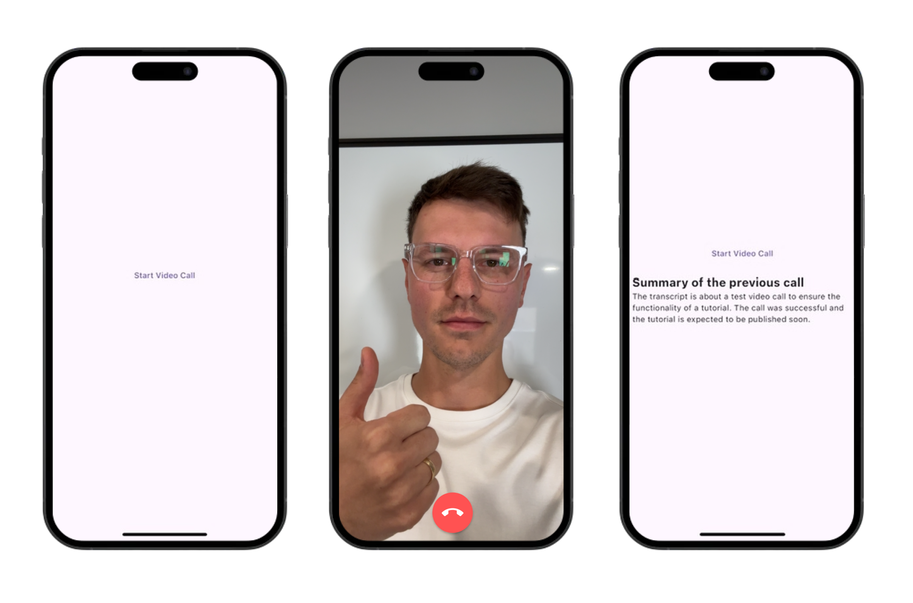
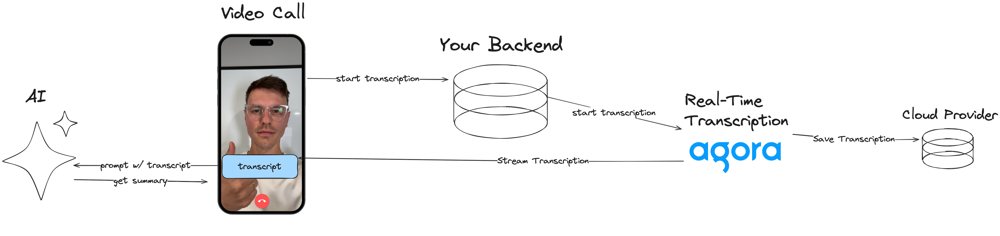

AI is taking over the world. Resistance is futile. So, in this article, we will combine AI with Agora and build an app that summarizes the call you just had.



## What you will need
1. Flutter
2. Agora Speech-to-Text Server (Can use [this example server](https://github.com/tadaspetra/agora-server))
3. Gemini API Key

Our starting point will be a simple video call app built with Agora. If you need to become more familiar with Agora, we have built an entire course covering all the fundamentals. 

[Here is the starter code](https://github.com/tadaspetra/agora/tree/main/call_summary/starter-app) if you want to follow along.

The starter code has a landing screen with only one button that invites you to join a call. This call happens on a single channel called `test` (it's a demo, okay). You have the remote users' video, your local video, and an end-call button within the call screen. Using the event handlers, we add and remove the users from the view.

If any part of the previous paragraph didn't make sense, please take a look at the [Flutter quickstart within the Agora documentation](https://docs.agora.io/en/video-calling/get-started/get-started-sdk?platform=flutter).

## Speech to Text
Agora has a product called Real Time Transcription that you can connect to to start transcribing the call of a specific channel.

Real-time Transcription is a RESTful API that connects to your call and starts transcribing the audio being spoken. This transcription is written to a cloud provider and can be accessed live within the call. 

### Backend

Real-Time Transcription needs to be implemented on your business server. The API call requires your Agora App ID, and sending it from your app over the network is not secure.

We will use [this server as our backend](https://github.com/tadaspetra/agora-server). This server will provide two endpoints.

#### Start Real Time Transcription
```
/start-transcribing/<--Channel Name-->
```

A successful response will contain the Task ID and the Builder Token, which you must save since you will need to use it to stop the transcription.

```
{taskId: <--Task ID Value-->, builderToken: <--Builder Token Value-->}
```
#### Stop Real Time Transcription
```
/stop-transcribing/<--Channel Name-->/<--Task ID-->/<--Builder Token-->
```


## Start Transcription within the Call
To make a network call from your Flutter application, you can use the `http` package. Make sure you use the same App ID on both the app and the backend server. Then, call your API to start the transcribing. 

You should receive a Task ID and a Builder Token back if everything works correctly. Save these because you will need them to stop the transcription.

```dart
Future<void> startTranscription({required String channelName}) async {
  final response = await post(
    Uri.parse('$serverUrl/start-transcribing/$channelName'),
  );

  if (response.statusCode == 200) {
    print('Transcription Started');
    taskId = jsonDecode(response.body)['taskId'];
    builderToken = jsonDecode(response.body)['builderToken'];
  } else {
    print('Couldn\'t start the transcription : ${response.statusCode}');
  }
}
```

We will call this function right after our join call method.

When the transcription starts successfully, it acts as if another user has joined the call. It's not a real user, but it does have its own UID, which is defined within your backend server. If you are using the [server I linked above](https://github.com/tadaspetra/agora-server), the UID is `101`. You can exclude this from the remote user's list in the `onUserJoined` event.

```dart
onUserJoined: (RtcConnection connection, int remoteUid, int elapsed) {
  if (remoteUid == 101) return;

  setState(() {
    _remoteUsers.add(remoteUid);
  });
}
```
## End Transcription
To end the transcription, we use a similar function to starting, except we must pass the Task ID and the Builder Token to the API call.

```dart
Future<void> stopTranscription() async {
  final response = await post(
    Uri.parse('$serverUrl/stop-transcribing/$taskId/$builderToken'),
  );
  if (response.statusCode == 200) {
    print('Transcription Stopped');
  } else {
    print('Couldn\'t stop the transcription : ${response.statusCode}');
  }
}
```

We will call the `stopTranscription` method in our call screen's `dispose` method. This will stop the transcription before we leave the channel and release the engine resource.

## Retrieve the Transcription
You can access the transcription through the `onStreamMessage` event in the event handler. 

```dart
onStreamMessage: (RtcConnection connection, int uid, int streamId,
    Uint8List message, int messageType, int messageSize) {
  print(message);
}
```

You will notice the code above prints out an array of numbers that only mean something to you if you are an all-knowing AI. We will need to use protobuf and create a readable object from this to decode.
## Decode the Transcription
We will use a Protocol Buffer (also refered to as protobuf) to decode the message. A protocol buffer is a language and platform neutral generator for serializing data. In this case, we will serialize the random-looking numbers into an object called `Message`. 

First, create a `.proto` file with the following content. I will put this file in a new folder: `lib/protobuf/file.proto`.

```
syntax = "proto3";

package call_summary;

message Message {
  int32 vendor = 1;
  int32 version = 2;
  int32 seqnum = 3;
  int32 uid = 4;
  int32 flag = 5;
  int64 time = 6;
  int32 lang = 7;
  int32 starttime = 8;
  int32 offtime = 9;
  repeated Word words = 10;
}
message Word {
  string text = 1;
  int32 start_ms = 2;
  int32 duration_ms = 3;
  bool is_final = 4;
  double confidence = 5;
}
```

This is the input file for the generator to create our `Message` object. 

In order to use protobuf you need to install the protobuf compiler to your computer. You can find the [download for it here](https://protobuf.dev/downloads/), or if you are using a Mac, you can install it using `brew install protobuf`.

You must also install the `protobuf` dart package within your project. You can do that using `flutter pub add protobuf`.

Now run the following command in your terminal. You should see four files generated in the same `lib/protobuf` folder.

```
protoc --proto_path= --dart_out=. lib/protobuf/file.proto  
```

Now, we can use the new `Message` object to retrieve our transcription in English. This object contains a `words` array with the transcribed sentences. Using the `isFinal` variable, we trigger a print statement whenever the sentence finishes.

```dart
onStreamMessage: (RtcConnection connection, int uid, int streamId,
    Uint8List message, int messageType, int messageSize) {
  Message text = Message.fromBuffer(message);
  if (text.words[0].isFinal) {
    print(text.words[0].text);
  }
},
```

## Save the Transcription
We have covered the transcription part. Now, we need to get the transcribed text and prompt an AI to give us a summary. The simplest way to do this is to concatenate a long string of responses. There are definitely more sophisticated ways to do it, but for this demo, it is good enough.

We can hold a string called `transcription` and add the text as it finalizes.

```dart
 onStreamMessage: (RtcConnection connection, int uid, int streamId,
	Uint8List message, int messageType, int messageSize) {
  Message text = Message.fromBuffer(message);
  if (text.words[0].isFinal) {
	print(text.words[0].text);
	transcription += text.words[0].text;
  }
},
```

## Get Summary
Back in the `main.dart`, we can connect to Gemini using our API key. Then, we can prompt it to summarize the video call. When you receive this response, you can call `setState` and update the `summary` variable to see your changes reflected on the main page.

> As I was testing this app, I noticed that the response liked to mention the transcript I passed. Because of this, I added some extra prompts so it does not mention the transcript.

This function is passed to the video call file and triggered when the call ends.

```dart
late final GenerativeModel model;

@override
void initState() {
  super.initState();
  model = GenerativeModel(model: 'gemini-pro', apiKey: apiKey);
}

void retrieveSummary(String transcription) async {
  final content = [
    Content.text(
      'This is a transcript of a video call that occurred. Please summarize this call in a few sentences. Dont talk about the transcript just give the summary. This is the transcript: $transcription',
    ),
  ];
  final response = await model.generateContent(content);
  setState(() {
    summary = response.text ?? '';
  });
}
```

## Done


This guide covers a simplified example of utilizing the Agora SDK and AI to make your apps even more powerful. 

You can find the [code here](https://github.com/tadaspetra/agora/tree/main/call_summary). And learn more about all the [Agora SDKs here](https://www.agora.io/en/).

Thank you for reading!


