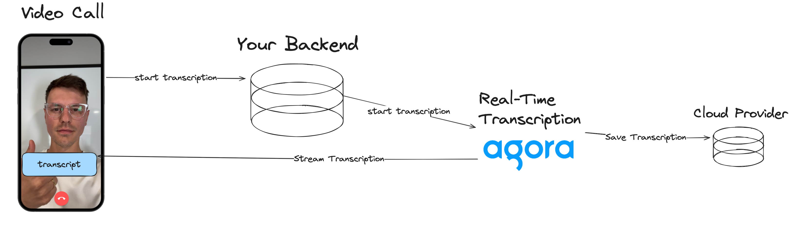

AI is taking over the world. Resistance is futile. So, if you can't beat'em might as well join'em. In this guide, we'll walk through how to combine AI with Agora and build a video call app that uses AI to summarizes the conversation you just had.


## Prerequisites 
1. Flutter
1. A developer account with [Agora.io](https://console.agora.io)
1. Agora Speech-to-Text Server (This guide uses [this example server](https://github.com/tadaspetra/agora-server))
1. Gemini API Key

## Project Setup
Our starting point will be a simple video call app built with Agora. This guide assues you have a basic understanding of how to build a video call app using Agora and Flutter. For a basic overview, take a look at the [Flutter quickstart within the Agora documentation](https://docs.agora.io/en/video-calling/get-started/get-started-sdk?platform=flutter). If you want to dive deeper, we've built an entire [Agora + Fltter course](https://course-demo-two.vercel.app/flutter) covering all the fundamentals. 

This guide also assumes you have a video-call app already set up. If not, [here's the starter code](https://github.com/tadaspetra/agora/tree/main/call_summary/starter-app) so you can follow along with my code.

The starter code has a landing screen with only one button that invites you to join a call. This call happens on a single channel called `test` (it's a demo, okay). You have the remote users' video, your local video, and an end-call button within the call screen. Using the event handlers, we add and remove the users from the view.

## Speech to Text
Agora has a product called Real Time Transcription that you can enable to start transcribing the call of a specific channel.

Agora's Real-time Transcription is a RESTful API that spins up an AI powered micro-service which connects to your call and starts transcribing the audio being spoken. The transcription output can be accessed live within the call using `streamMessage` events, and it can also be written to a cloud provider. Even though the cloud storage config is optional, we'll still include it in this guide.

### Backend

Real-Time Transcription should be implemented from your business server for multiple reasons. The main reason beeing limiting the number of RTT instances running for a single channel. Another reason is the API call to start transcription requires a valid token which needs to be generated from your backend, and exposing this token on the client side is not secure. 

For this guide I'm using [this server as my backend](https://github.com/tadaspetra/agora-server), it exposes two endpoints: one to start the transcription and another to end the task.

#### Start Real Time Transcription
```
/start-transcribing/<--Channel Name-->
```

A successful response will contain the Task ID and the Builder Token. We need to save both of these values because we'll need to use them to stop the transcription.

```
{taskId: <--Task ID Value-->, builderToken: <--Builder Token Value-->}
```
#### Stop Real Time Transcription
```
/stop-transcribing/<--Channel Name-->/<--Task ID-->/<--Builder Token-->
```


## Start Transcription within the Call
There are multiple ways to make network API calls from your Flutter application,depending on the specific use case and requirements of your application. In this guide we'll use the `http` package, but you can use Dio if you prefer. Make sure you use the same App ID on both the app and the backend server. Then, call your API to start the transcribing. 

For those using the starter app, open the [`call.dart`](./lib/call.dart) and add the `startTranscription` function.

```dart
Future<void> startTranscription({required String channelName}) async {
  final response = await post(
    Uri.parse('$serverUrl/start-transcribing/$channelName'),
  );

  if (response.statusCode == 200) {
    print('Transcription Started');
    taskId = jsonDecode(response.body)['taskId'];
    builderToken = jsonDecode(response.body)['builderToken'];
  } else {
    print('Couldn\'t start the transcription : ${response.statusCode}');
  }
}
```

We'll call this function right after our join call method to start transcription as the user is joining the channel. As part of a successful response we'll receive a Task ID and a Builder Token. Save these because you will need them to stop the transcription.

When the transcription service starts successfully it uses a "bot" to join the channel, similar to any other remote users. But it's not a real user, so we don't want them to appear in the UI like the other remote users. To filter out the RTT service we'll need use it's UID, which should be defined by your backend server. I set the UID to `101` in [server linked above](https://github.com/tadaspetra/agora-server), so anytime the `onUserJoined` event is triggered we can check if it's UID is `101` and exclude it from our list of remote users. 

```dart
onUserJoined: (RtcConnection connection, int remoteUid, int elapsed) {
  if (remoteUid == 101) return;

  setState(() {
    _remoteUsers.add(remoteUid);
  });
}
```
## End Transcription
To end the transcription, we'll create a `stopTranscription` function, where we tell our backend server to call the RTT API similar to `startTranscription`, except instead of a config we pass the Task ID and the Builder Token to our backend.

```dart
Future<void> stopTranscription() async {
  final response = await post(
    Uri.parse('$serverUrl/stop-transcribing/$taskId/$builderToken'),
  );
  if (response.statusCode == 200) {
    print('Transcription Stopped');
  } else {
    print('Couldn\'t stop the transcription : ${response.statusCode}');
  }
}
```

We'll call the `stopTranscription` method in the call screen's `dispose` method. This will stop the transcription before we leave the channel and release the engine resource.

## Retrieve the Transcription
While a client device is in the channel it can access the transcription through the `onStreamMessage` event in the event handler. Let's add a print statement and take a look at the "messages" recieved by this callback.

```dart
onStreamMessage: (RtcConnection connection, int uid, int streamId,
    Uint8List message, int messageType, int messageSize) {
  print(message);
}
```

You'll notice the message recieved is an array of numbers that you might think only mean something to you if you are an all-knowing AI. Don't worry, this array data is using [Google's Protocol Buffers](https://protobuf.dev) which provide a platform agnostic way to serialize data, kinda like XML but more efficient.
## Decode the Transcription
We'll use a Protocol Buffer (refered to as protobuf) to decode the message and create a readable object called `Message`. Start by creating a `.proto` file with the following content: 

```
syntax = "proto3";

package call_summary;

message Message {
  int32 vendor = 1;
  int32 version = 2;
  int32 seqnum = 3;
  int32 uid = 4;
  int32 flag = 5;
  int64 time = 6;
  int32 lang = 7;
  int32 starttime = 8;
  int32 offtime = 9;
  repeated Word words = 10;
}
message Word {
  string text = 1;
  int32 start_ms = 2;
  int32 duration_ms = 3;
  bool is_final = 4;
  double confidence = 5;
}
```

Put this file in a new folder: `lib/protobuf/file.proto`. This is the input file for the generator to create our `Message` object. 

In order to use protobuf you need to install the protobuf compiler to your computer. It's available via package managers for Mac (`brew install protobuf`), and Linux (`apt install -y protobuf-compiler`). For Windows or if you need a specific version check the [Prottobuf downloads page](https://protobuf.dev/downloads/).

You must also install the `protobuf` dart package within your project. Do that using `flutter pub add protobuf`.

Now run the following command in your terminal. You should see four files generated in the same `lib/protobuf` folder.

```
protoc --proto_path= --dart_out=. lib/protobuf/file.proto  
```

Now that we have our protobuffer setup, we can use the new `Message` object to retrieve our transcription in English. This object contains a `words` array with the transcribed sentences. Using the `isFinal` variable, we trigger a print statement whenever the sentence finishes.

```dart
onStreamMessage: (RtcConnection connection, int uid, int streamId,
    Uint8List message, int messageType, int messageSize) {
  Message text = Message.fromBuffer(message);
  if (text.words[0].isFinal) {
    print(text.words[0].text);
  }
},
```

## Save the Transcription
Now that we've covered how to get transcription running and the messages decoded, we need to store the transcribed text so we can use it to prompt an AI for a summary. The RTT service sends the transcribed audio in chunks, so as audio chunks are processed the serialized data is sent in bursts, each time triggering the `onStreamMessage` event. The simplest way to store these chunks of transcription text is to concatenate them into a long string of responses. There are definitely more sophisticated ways to do it, but for this demo I want to keep things concise.

We can hold a string called `transcription` and add the text as it finalizes.

```dart
 onStreamMessage: (RtcConnection connection, int uid, int streamId,
	Uint8List message, int messageType, int messageSize) {
  Message text = Message.fromBuffer(message);
  if (text.words[0].isFinal) {
	print(text.words[0].text);
	transcription += text.words[0].text;
  }
},
```

## Get Summary
Moving back to the [`main.dart`](./lib/main.dart), we're ready to connect to Gemini using our API key and prompt it to summarize the video call transcript. Once Gemini repsonds with the summary use `setState` to update the `summary` variable and see your summary appear on the main page.

> As I was testing this app, I noticed that the response liked to mention/refer the original transcript passed, so I added some extra prompts to avoid any mention of the transcript.

Since we need to pass the transcript string to the `retrieveSummary` we'll pass the function to [call.dart](./lib/call.dart) and call it when the call ends.

```dart
late final GenerativeModel model;

@override
void initState() {
  super.initState();
  model = GenerativeModel(model: 'gemini-pro', apiKey: apiKey);
}

void retrieveSummary(String transcription) async {
  final content = [
    Content.text(
      'This is a transcript of a video call that occurred. Please summarize this call in a few sentences. Dont talk about the transcript just give the summary. This is the transcript: $transcription',
    ),
  ];
  final response = await model.generateContent(content);
  setState(() {
    summary = response.text ?? '';
  });
}
```

## Done


This guide covers a simplified example of utilizing the Agora SDK and AI to make your apps even more powerful. 

You can find the [code here](https://github.com/tadaspetra/agora/tree/main/call_summary). And learn more about all the [Agora SDKs here](https://www.agora.io/en/).

Thank you for reading!


